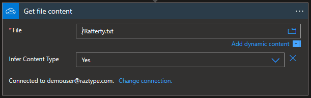
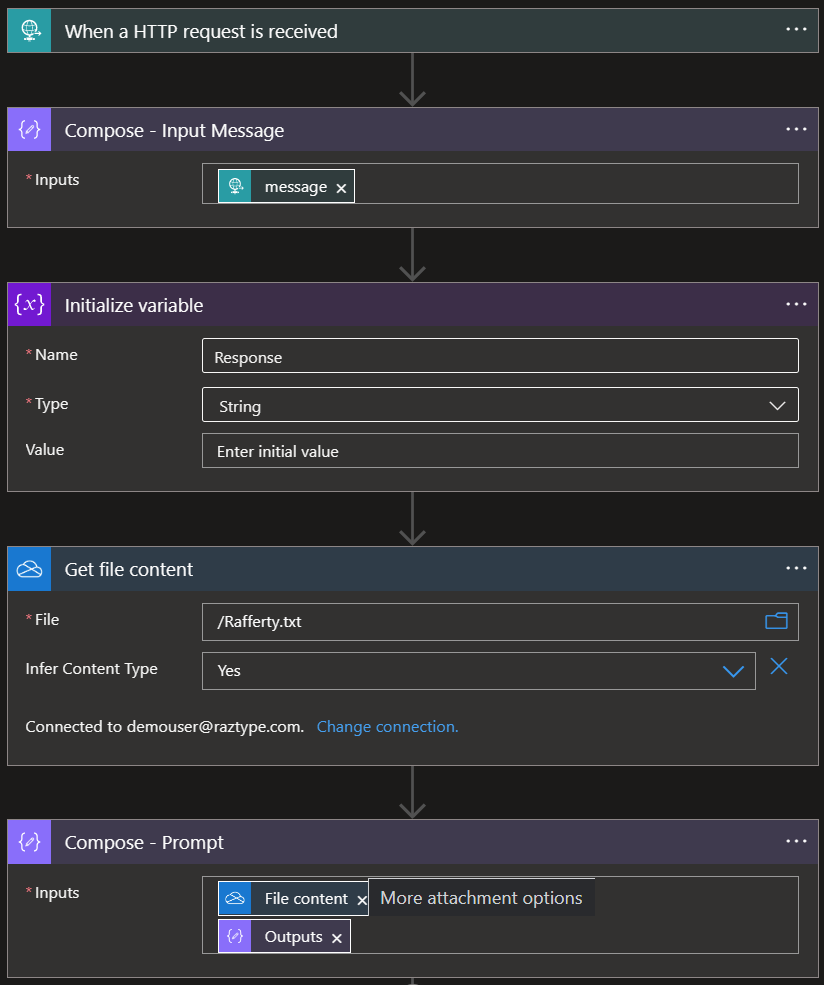
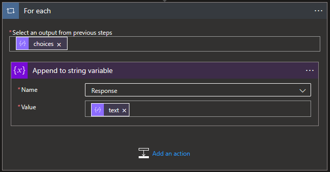
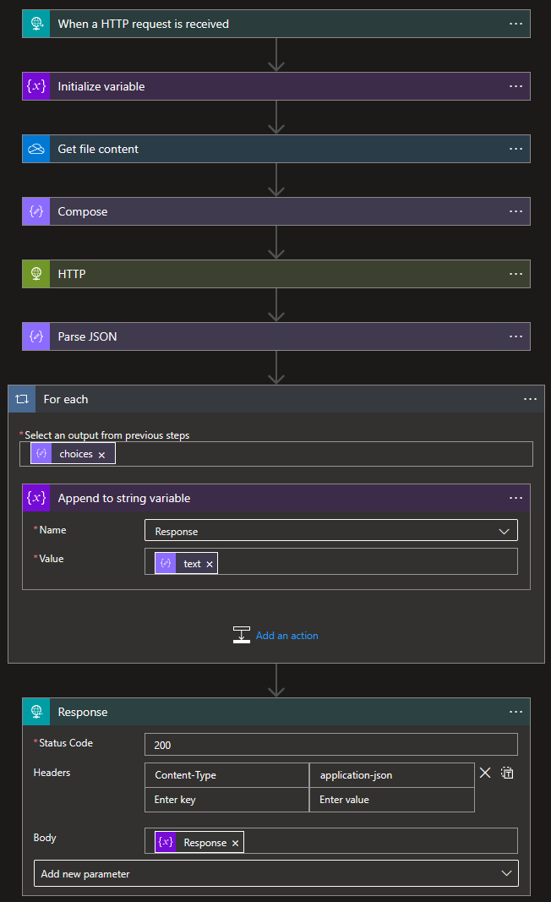
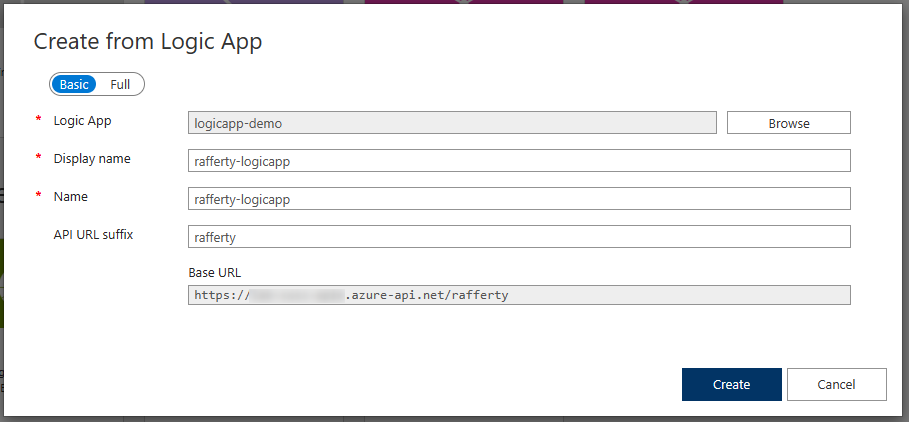
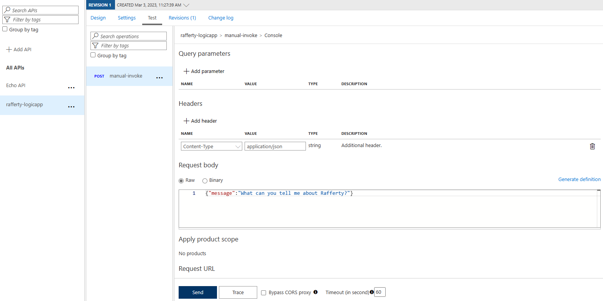
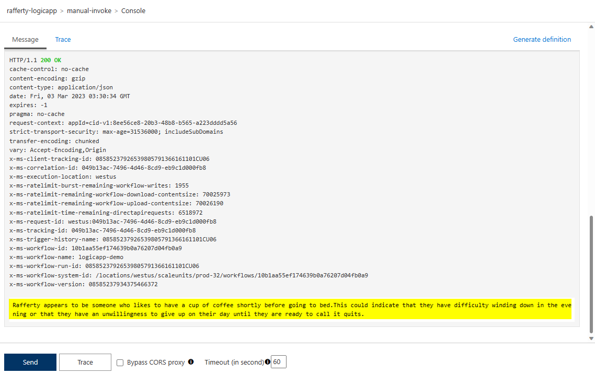
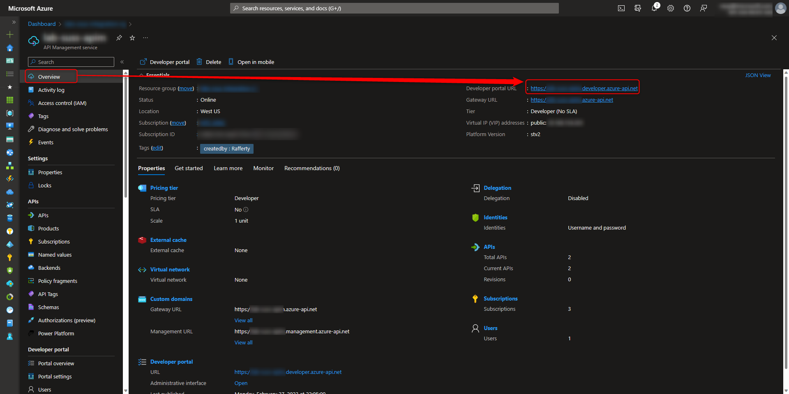
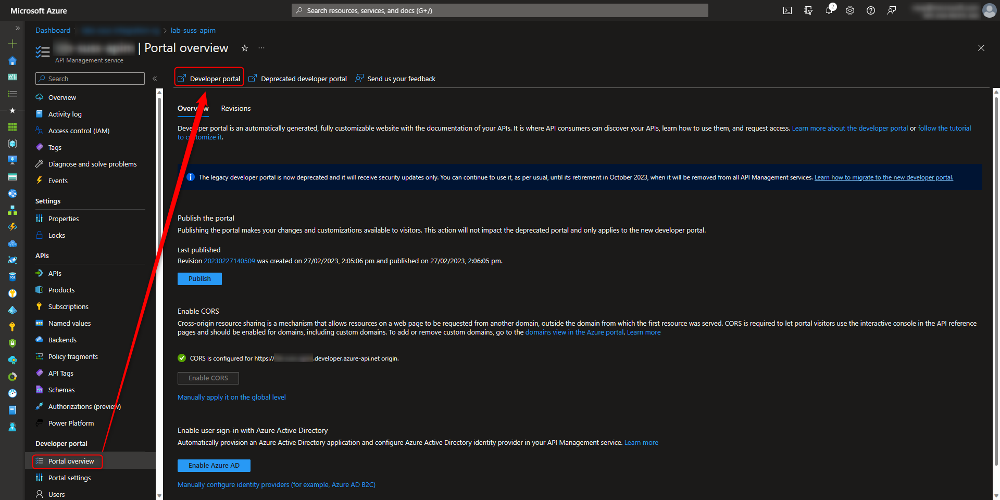

# Azure Integration Services - Hands-on Labs

## Pre-requisites
1. Active Azure Subscription (get one [here](https://azure.microsoft.com/en-us/free/)).
2. \[Part 1\] A OneDrive account (M365 or personal)
3. \[Part 1\] An OpenAI account (either [Azure OpenAI](https://azure.microsoft.com/en-us/products/cognitive-services/openai-service) or directly from [OpenAI](https://platform.openai.com/signup))
4. \[Part 2\] An [Azure API Management](https://learn.microsoft.com/en-us/azure/api-management/get-started-create-service-instance). This is for Part 2, but this 30-120 mins to provision, so best start now.

> **FOR TRAINERS:** You may pre-create items 1, 3, 4 and 5 above to make the lab faster.
> - Create lab user accounts, with access to an Azure Resource Group.
> - Pre-provision an Azure API management in this resource group.
> - Provide the OpenAI API URL and API key.
> - Provide the SendGrid API URL and API key.

## Hands-on Lab

### Challenge 1: Creating the Azure Logic App
> **IDEA:** Create a new REST API using Azure Logic Apps that...
> - Takes a text input
> - Create an OpenAI prompt text: combining a text content from OneDrive, and the request text body
> - Call OpenAI completion API, using text-davinci-002
> - \[Optional\] Send the result to an e-mail address
> - Return the result as an API Response

#### **1a: Create a Text file with content in OneDrive**
1. On your local machine, create a text file with the filename **/<your-name/>.txt**
2. In the file, enter a fun fact about yourself that the internet does not know. Avoid using special characters like the following `/ \ ' " ; < >` For example
    ```
    YOUR-NAME likes to drink coffee before sleeping.
    ```
3. Go to https://onedrive.live.com/ and login with the demo account provided (or your own preferred account)
4. Upload the text file that you created in #2.

#### **1b: Create a Logic App**
1. Sign into https://portal.azure.com
2. Create a new Azure Logic App resource
    - Resource name: /<your-name-abbreviation/>-logicapp
    - Region: West US
    - Resource Group: Your assigned resource group (or create a new one)
3. On the left, Click **Logic app designer**
4. Select **"When a HTTP request is received"**
5. Click on **"Use sample payload to generate schema"** and enter the following
    ```
    {"message":"Hello"}
    ```
6. It should look like this 
7. Don't forget to save.
8. Add a step **Initialize Variable**, which is under **Variables** 
9. Add a step and look for OneDrive (for personal accounts) or OneDrive for Business (for M365 accounts)
10. Select the action **Get file content** 
11. Sign In with the OneDrive account you used in [1a](#1a-create-a-text-file-with-content-in-onedrive)
12. In *File, browse for your text file 
13. Add a step **Compose**, which is under **Data Operations**
14. Add as input the OneDrive **File content** and the HTTP Request **message**. It should look like this 
15. Don't forget to save.
16. Add a step **HTTP** and enter the following:
    ```
    Method: POST

    // Change to the OpenAI completion URL if that's what you're using.
    URL: https://{your-resource-name}.openai.azure.com/openai/deployments/{deployment-id}/completions?api-version=2022-12-01

    Headers:
    1. api-key: {your-api-key}
    2. Content-Type: application/json

    Body:
    {
        "prompt":"{Outputs from #12}",
        "max_tokens": 1000
    }
    ```
17. Here's an example: 
18. Add a step **Parse JSON**, under **Data Operations**
19. In the content, select the **Body** from the **HTTP** action
20. In the Schema, copy-paste the following
    ```
    {
        "type": "object",
        "properties": {
            "id": {
                "type": "string"
            },
            "object": {
                "type": "string"
            },
            "created": {
                "type": "integer"
            },
            "model": {
                "type": "string"
            },
            "choices": {
                "type": "array",
                "items": {
                    "type": "object",
                    "properties": {
                        "text": {
                            "type": "string"
                        },
                        "index": {
                            "type": "integer"
                        },
                        "finish_reason": {
                            "type": "string"
                        },
                        "logprobs": {}
                    },
                    "required": [
                        "text",
                        "index",
                        "finish_reason",
                        "logprobs"
                    ]
                }
            },
            "usage": {
                "type": "object",
                "properties": {
                    "completion_tokens": {
                        "type": "integer"
                    },
                    "prompt_tokens": {
                        "type": "integer"
                    },
                    "total_tokens": {
                        "type": "integer"
                    }
                }
            }
        }
    }
    ```
21. Don't forget to save.
22. Add a step **Append to string variable**, under **Variables**
23. For the name, select _Response_
24. For the value, select **text** from the **Parse JSON** action. This will automatically place this action in a For each loop. 
25. Finally, add a step **Response**, under **Request** with the following values
    ```
    Status Code: 200

    Headers:
    1. Content-Type: application/json

    Body:
    {"response":"{response-variable}"}
    ```
26. Save.

**If your logic app looks like this, congratulations! You've completed Challenge 1.**


#### 1c: (OPTIONAL) Send an E-mail or SMS Notification
Modify the logic app and send an e-mail or sms to yourself, with the OpenAI response. You may use [SendGrid](https://www.sendgrid.com) or [Azure Communication Services](https://azure.microsoft.com/en-us/products/communication-services/).

#### 1d: (OPTIONAL) Explore other Logic App Connectors
- [FTP](https://learn.microsoft.com/en-us/azure/connectors/connectors-create-api-ftp?tabs=consumption) and [SFTP-SSH](https://learn.microsoft.com/en-us/azure/connectors/connectors-sftp-ssh?tabs=consumption) connectors
- [SharePoint](https://learn.microsoft.com/en-us/connectors/sharepointonline/) connector
- [SQL Server](https://learn.microsoft.com/en-us/connectors/sql/)
- [Adobe PDF Services](https://learn.microsoft.com/en-us/connectors/adobepdftools/) connector
- [Zoom Meetings](https://learn.microsoft.com/en-us/connectors/zoommeetingsip/)
- See [full list here](https://learn.microsoft.com/en-us/connectors/connector-reference/connector-reference-logicapps-connectors)
- Also read on the [on-premise gateway](https://learn.microsoft.com/en-us/azure/logic-apps/logic-apps-gateway-connection) to connect to any of the [supported on-premise data sources](https://learn.microsoft.com/en-us/azure/logic-apps/logic-apps-gateway-connection#supported-data-sources)

### Challenge 2: Azure API Management with Logic Apps
> **IDEA:** Use APIM as an abstraction layer (gateway) between the API consumer and the Azure Logic App.
> - Add the Azure Logic App in API management
> - Observe the generated policies, etc.
> - Test the API and troubleshoot if needed.

1. While still in your **Azure Logic App**, copy the **HTTP POST URL** HTTP trigger that was automatically generated (at the very top of your logic app) 
2. Now go to the **Azure API Management** resource that was created in the [Pre-requisites](#pre-requisites)
3. On the left, click **API**, and click **+ Add API**
4. Click on **Create from Azure Resource** --> **Logic App**
5. Browse for your logic app. And if you are sharing the API management with other lab participants, change the display name to something that says it's yours
6. In the **API URL suffix**, enter your name abbreviation
7. If it looks something like this, click **Create** 
8. A new API with a _manual-invoke_ operation should be created. Click on this operation and observe what is auto-generated in the various parts: _Frontend, Inbound processing, Backend, and Outbound processing_
9. Click on the **Test** tab and change the message. _Ask something about yourself_ and then click **Send** 
10. If you encounter any issues, troubleshoot. _(TIP: The problem may either be in the logic app or API management. You may use [Postman](https://www.postman.com/) to test-call the logic app URL directly)_
10. Scroll down and see the response. 

### Challenge 3: Explore Azure API Management - Developer Portal
> **IDEA:** Learn about the _Developer Portal_. Discuss and explore the concept of _Products_ and _Subscriptions._
1. Stay in the **Azure Portal** --> **API Management** resource
2. Click on **Overview** (on the left), and then click on the **Developer portal URL** (on the right). This is the URL that you can send to your developers. 
3. Try creating an account, subscribing to a product, and testing through the portal.
4. To modify the Developer Portal UI, go back to the **Azure Portal** and look for **Developer portal** --> **Portal overview**. Click the **Developer portal** button on top. This opens the portal in administrative/edit mode. 